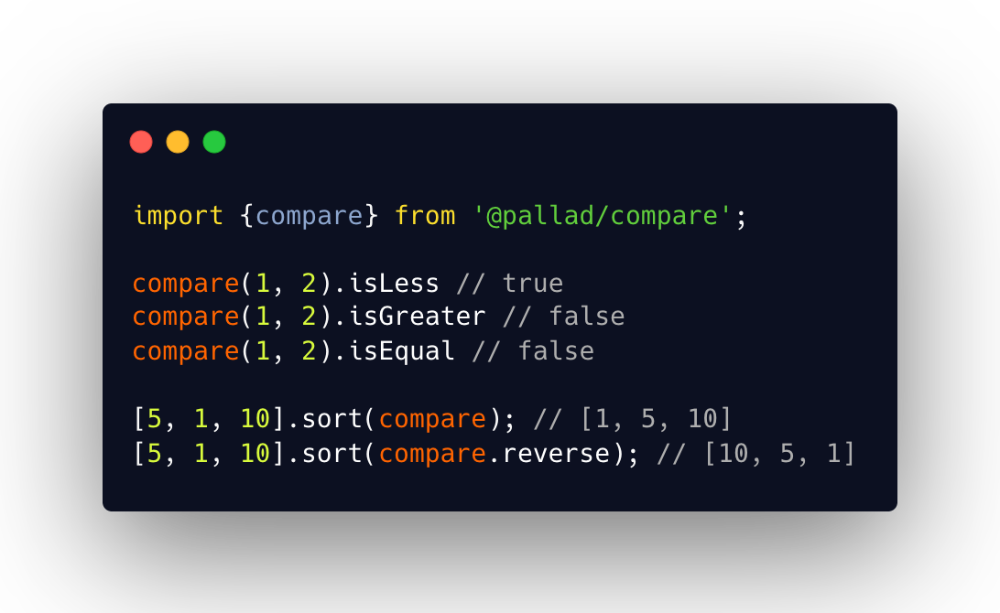

<div align="center">
	<h1>compare ⬆️⬇️️</h1>
	<p>Custom sorting inspired by Rust</p>
</div>

---
[](https://circleci.com/gh/pallad-ts/compare/tree/master)
[](https://badge.fury.io/js/@pallad%2Fcompare)
[](https://coveralls.io/github/pallad-ts/compare?branch=master)
[](https://opensource.org/licenses/MIT)
---



Sorting library inspired by [Rust's Ordering](https://doc.rust-lang.org/std/cmp/enum.Ordering.html).

Allows to easy definition of comparison abilities for your objects, especially value objects.

# Community

Join our [discord server](https://discord.gg/cbpxw93DnS)

# Installation

```shell
npm install @pallad/compare
```

# Usage

Comparing two values of same type

```typescript
import {compare} from '@pallad/compare';

compare(1, 2).isLess // true
compare(1, 2).isGreater // false
compare(1, 2).isEqual // false
```

## Sorting

`compare` first tries to leverage `compare` defined by `Comparable` interface if that is possible. 
Otherwise fallbacks to regular operators (`<`, `==`, `>`) comparison.

```typescript
import {compare} from '@pallad/compare';

[5, 1, 10].sort(compare); // [1, 5, 10]
[5, 1, 10].sort(compare.reverse); // [10, 5, 1]
```

## Defining custom sorting for value objects

```typescript
import {Comparable, Equal, Less, Greater} from '@pallad/compare';

class Money implements Comparable {
	constructor(readonly value: number, readonly currency: string) {
	}

	compare(another: Money) {
		if (another.currency !== this.currency) {
			throw new Error('Cannot compare values with different currencies');
		}

		if (another.value === this.value) {
			return Equal;
		} else if (this.value < another.value) {
			return Less
		}
		return Greater;
	}
}


const amountA = new Money(100, 'BGP');
const amountB = new Money(200, 'BGP');

amountA.compare(amountB) // Less

// uses `compare` since it is defined
compare(amountA, amountB); // Less
```

# Explanation

As in Rust's `Ordering` - `@pallad/compare` uses 3 immutable objects to describe the comparison result.

The result could be:

* `Less`
* `Equal`
* `Greater`

Each of them implements following shape:

```typescript
interface Api {
	type: 'equal' | 'less' | 'greater',
	/**
	 * Indicates that value is lower
	 */
	isLess: boolean;
	/**
	 * Indicates that values are equal
	 */
	isEqual: boolean;
	/**
	 * Indicates that values are not equal (less or greater only)
	 */
	isNotEqual: boolean;
	/**
	 * Indicates that value is less or equal
	 */
	isLessOrEqual: boolean;
	/**
	 * Indicates that value is greater or equal
	 */
	isGreaterOrEqual: boolean;
	/**
	 * Indicates that value is greater
	 */
	isGreater: boolean;

	/**
	 * Maps result to another value
	 */
	map(ifLess: T1, ifEqual: T2, ifGreater: T3): T1 | T2 | T3;

	map({less: T1, equal: T2, greater: T3}): T1 | T2 | T3;

	/**
	 * Returns opposite value to current one
	 *
	 * Less -> Greater
	 * Equal -> Equal
	 * Greater -> Less
	 */
	reverse: Result;
	/**
	 * Just numeric value you can use in `.sort` functions
	 */
	sortResult: 0 | -1 | 1,
	/**
	 * Just numeric value you can use in `.sort` functions to reverse sorting
	 */
	sortResultReversed: 0 | -1 | 1,
}
```

# Mapping

You can map comparison result to any other value

```typescript
import {compare} from '@pallad/compare';

// using arguments for each value
const r1 = compare(1, 5).map('less', 'equal', 'greater') // 'less'
type R1 = typeof r1; // 'less' | 'equal' | 'greater'  

// using object
const r2 = compare(1, 5).map({
	less: 'less',
	equal: 'equal',
	greater: 'greater'
}) // 'less'

type R2 = typeof r2; // 'less' | 'equal' | 'greater'
```

## Mapping to boolean
Before your try to map to booleans, think if currently available helpers are not good enough

```typescript
import {compare} from '@pallad/compare';

compare(1, 10).map(false, true, false); // Too explicit ⚠️
compare(1, 10).isEqual // better 👌

compare(1, 10).map(true, true, false); // Too explicit ⚠️
compare(1, 10).isLessOrEqual // better 👌
```
